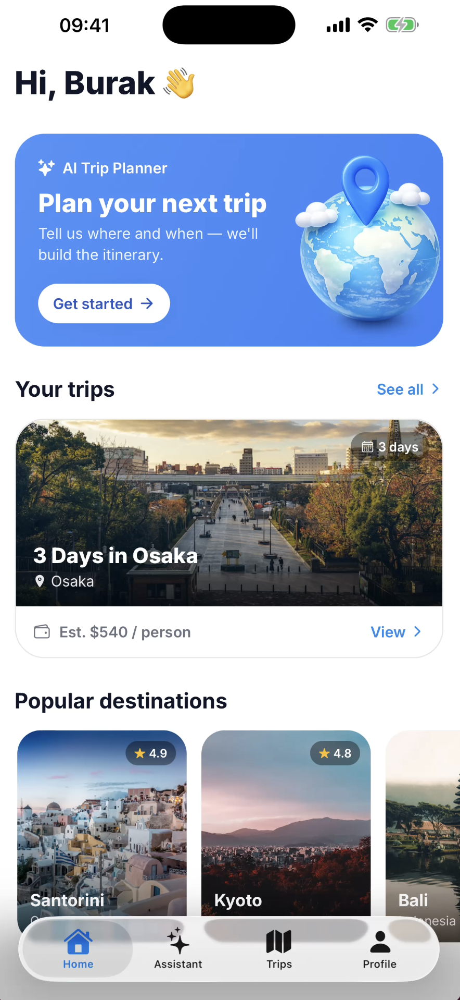
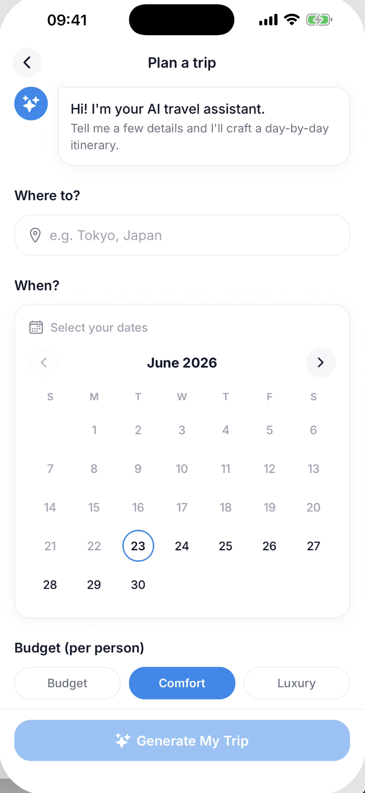
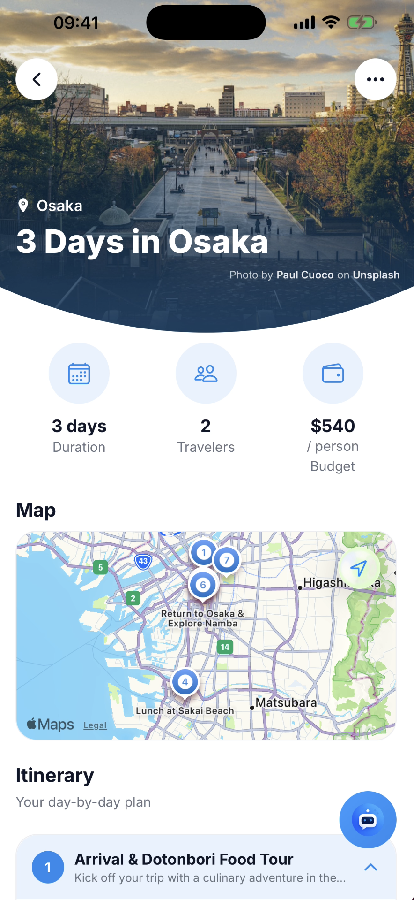
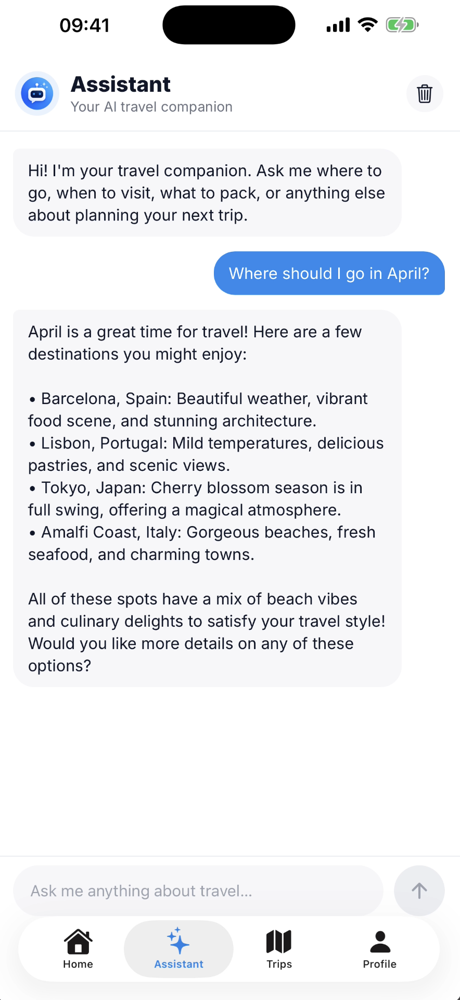
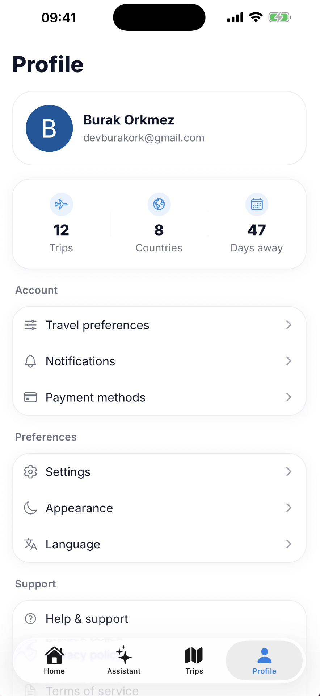

<p align="center">
  
</p>

<h1 align="center">TRAVEL-PLANNER</h1>

<p align="center">
  An AI trip planner that turns a destination and a few preferences into a full itinerary and budget breakdown.
</p>

<p align="center">
  
  
  
  
  
</p>

---

## Overview

Triply is a mobile-first travel app: users sign in, describe a trip (destination, dates, travelers, budget tier, interests), and an AI generation pipeline produces a day-by-day itinerary and budget breakdown. Users can chat with an AI assistant to refine a trip, browse past trips, and manage their profile and preferences.

Built as a full end-to-end product — native mobile client, authentication, database, background job processing, and third-party integrations — rather than just a UI shell.

## Features

- **AI-generated itineraries** — describe a destination, dates, traveler count, and budget tier; Google Gemini generates a structured day-by-day itinerary and budget breakdown.
- **Conversational refinement** — an AI assistant chat for iterating on a generated trip.
- **Authentication** — Google and Apple sign-in via Clerk, with webhook-driven user sync to the database.
- **Trip history** — view, retry, and track the status of previously generated trips.
- **Background processing** — trip generation and user sync run as async, event-driven jobs via Inngest, so the UI stays responsive.
- **Native navigation** — system tab bar (SwiftUI / Jetpack Compose) via `expo-router/unstable-native-tabs`, not a JS-rendered tab bar.
- **Profile & settings** — travel preferences, appearance, notifications, and account management.
- **Error tracking** — Sentry wired into both the client and API routes.

## Preview

<table>
  <tr>
    <td align="center"><br/><sub>Sign in</sub></td>
    <td align="center"><br/><sub>Home</sub></td>
    <td align="center"><br/><sub>Generate a trip</sub></td>
  </tr>
  <tr>
    <td align="center"><br/><sub>Trip detail</sub></td>
    <td align="center"><br/><sub>AI assistant</sub></td>
    <td align="center"><br/><sub>Profile</sub></td>
  </tr>
</table>

## Tech stack

| Layer | Technology |
| --- | --- |
| Framework | Expo SDK 57 (managed workflow), Expo Router (file-based, typed routes) |
| UI | React 19, React Native 0.86, NativeWind v4 (Tailwind), `@expo/ui`, native tab bar |
| Language | TypeScript (strict mode) |
| Auth | Clerk (Google & Apple sign-in) |
| Database | Postgres (Neon) via Drizzle ORM |
| AI | Google Gemini |
| Media | ImageKit, Unsplash |
| Background jobs | Inngest (event-driven functions) |
| Monitoring | Sentry |

## Architecture

```
Client (Expo / React Native)
   │  Clerk session
   ▼
Expo Router API routes (src/app/api/**)
   │
   ├─ Drizzle ORM ──► Neon Postgres      (trips, users, messages)
   ├─ Gemini API   ──► trip generation
   ├─ Inngest      ──► async jobs: user sync (Clerk webhooks), trip generation
   └─ ImageKit / Unsplash ──► trip cover images
```

## Getting started

### Prerequisites

- Node.js and npm
- Xcode (iOS) and/or Android Studio (Android) for native builds
- Accounts/API keys for Clerk, Neon, Gemini, ImageKit, Unsplash, Inngest, and Sentry

### 1. Install dependencies

```bash
npm install
```

### 2. Configure environment variables

Create a `.env` file in the project root with:

```
EXPO_PUBLIC_CLERK_PUBLISHABLE_KEY=
CLERK_SECRET_KEY=
CLERK_WEBHOOK_SIGNING_SECRET=
DATABASE_URL=
GEMINI_API_KEY=
UNSPLASH_ACCESS_KEY=
UNSPLASH_SECRET_KEY=
INNGEST_DEV=
INNGEST_SIGNING_KEY=
INNGEST_EVENT_KEY=
IMAGEKIT_PRIVATE_KEY=
IMAGEKIT_PUBLIC_KEY=
IMAGEKIT_URL_ENDPOINT=
SENTRY_AUTH_TOKEN=
```

### 3. Push the database schema

```bash
npx drizzle-kit push
```

### 4. Run the app

```bash
npm start        # start the dev server
npm run ios      # run on iOS simulator
npm run android  # run on Android emulator
npm run web      # run on web (non-tab screens only, see below)
```

### 5. (Optional) Run background jobs locally

```bash
npm run inngest
```

## Project structure

```
src/
  app/           Expo Router routes — screens and API routes (app/api/**)
  components/    Shared UI components
  db/            Drizzle schema and query helpers
  inngest/       Inngest client and background functions
  lib/           Clerk, Gemini, ImageKit, Unsplash, auth, and other integrations
```

## Scripts

| Command | Description |
| --- | --- |
| `npm start` | Start the Expo dev server |
| `npm run ios` | Run on iOS simulator |
| `npm run android` | Run on Android emulator |
| `npm run web` | Run the web dev server |
| `npm run lint` | Lint the project |
| `npm run inngest` | Run the local Inngest dev server |

## Platform notes

- iOS and Android are the primary targets, both using the native system tab bar.
- Web is a secondary target: tabbed navigation is native-only and not implemented for web.
- No test runner is configured yet.
